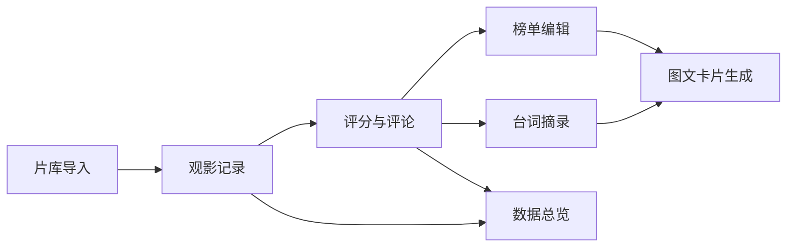

## 1. 产品概述

影视追踪平台纯前端看板，专为影评博主打造的年度观影内容整理工具。提供片库管理、观影记录、榜单编辑、台词摘录、图文卡片生成、数据统计分析等一体化功能，帮助博主高效管理观影足迹、产出优质内容。

- 核心价值：一站式观影记录与内容生产工具，纯前端本地存储，数据隐私可控
- 目标用户：影评博主、影视爱好者、内容创作者
- 产品定位：个人观影数据中台 + 内容生产工具

## 2. 核心功能

### 2.1 用户角色
| 角色 | 注册方式 | 核心权限 |
|------|----------|----------|
| 博主用户 | 本地使用无需注册 | 全部功能访问、数据本地存储、导出分享 |

### 2.2 功能模块
1. **片库导入**：手动添加影片、批量导入清单文件、类型/年份筛选、搜索
2. **观影日历**：日历视图展示观影记录、月度热力图、观看状态标记
3. **评分矩阵**：多维评分展示、评分分布统计、类型评分对比
4. **榜单编辑**：拖拽排序榜单、多榜单管理、公开/私密设置
5. **台词摘录**：台词收藏、截图保存、台词卡片生成
6. **图文卡片**：九宫格卡片生成、自定义样式、导出图片
7. **数据总览**：年度观影统计、导演/演员偏好分析、重看片单管理

### 2.3 页面详情
| 页面名称 | 模块名称 | 功能描述 |
|----------|----------|----------|
| 主看板 | 导航切换 | 七大板块Tab切换、侧边导航栏 |
| 片库导入 | 影片列表 | 影片卡片展示、筛选排序、搜索 |
| 片库导入 | 添加影片 | 手动添加表单、批量导入文件 |
| 片库导入 | 影片详情 | 评分、观看状态、短评长评编辑 |
| 观影日历 | 日历视图 | 月历/年历切换、观影日期标记 |
| 观影日历 | 热力图 | 月度观影热力图、统计数据 |
| 评分矩阵 | 评分图表 | 评分分布柱状图、类型评分雷达图 |
| 评分矩阵 | 评分列表 | 按评分排序、筛选 |
| 榜单编辑 | 榜单列表 | 已创建榜单、新建榜单入口 |
| 榜单编辑 | 榜单详情 | 拖拽排序、添加/移除影片、设置公开/私密 |
| 台词摘录 | 台词墙 | 台词卡片瀑布流展示 |
| 台词摘录 | 台词编辑 | 添加台词、上传截图、关联影片 |
| 图文卡片 | 卡片生成器 | 模板选择、自定义文案、九宫格布局 |
| 图文卡片 | 导出预览 | 实时预览、导出图片 |
| 数据总览 | 统计概览 | 年度数据总览、关键指标卡片 |
| 数据总览 | 偏好分析 | 导演/演员/类型偏好统计图表 |
| 数据总览 | 重看片单 | 重看影片管理、重看次数统计 |
| 设置 | 数据管理 | 备份数据、恢复数据、清空数据 |

## 3. 核心流程

### 3.1 影片录入流程
用户添加影片 → 填写基本信息（片名、年份、类型、导演、演员）→ 设置观看状态与日期 → 填写评分与评论 → 保存到片库

### 3.2 榜单制作流程
创建新榜单 → 从片库选择影片加入榜单 → 拖拽调整排序 → 设置榜单标题与描述 → 可选设置公开/私密 → 保存榜单

### 3.3 卡片生成流程
选择卡片模板 → 选择影片/台词/榜单数据 → 自定义文案与样式 → 预览效果 → 导出为图片

## 4. 用户界面设计

### 4.1 设计风格
- **整体定位**：深色影院风格，沉浸式观影体验，类似电影资料库的编辑感
- **主色调**：深邃炭黑 (#0F0F12) 为底，琥珀金 (#D4AF37) 为点缀，营造胶片质感
- **辅助色**：哑光银 (#8A8A8A)、暗红色 (#8B0000)、淡金色 (#F5E6A3)
- **按钮风格**：微立体圆角按钮，hover时有微光效果，主按钮采用琥珀金渐变
- **字体**：标题使用具有电影感的衬线字体（Playfair Display），正文使用清晰易读的无衬线字体（Noto Sans SC）
- **布局风格**：卡片式布局 + 侧边导航 + 主内容区，左侧固定导航，右侧内容区
- **视觉元素**：胶片齿孔装饰、暗角效果、轻微颗粒纹理、金色描边
- **图标风格**：线性图标，金色填充，带有复古电影元素

### 4.2 页面设计概览
| 页面名称 | 模块名称 | UI元素 |
|----------|----------|--------|
| 主看板 | 侧边导航 | 垂直导航栏、金色图标、当前选中高亮、板块切换动画 |
| 片库导入 | 影片网格 | 卡片悬停放大效果、金色边框高亮、评分角标 |
| 观影日历 | 日历视图 | 日期格子、观影标记点、热力色阶、月份切换动画 |
| 评分矩阵 | 图表区域 | 渐变柱状图、金色数据点、悬停tooltip |
| 榜单编辑 | 排序列表 | 拖拽手柄、拖动时阴影、放置位置指示线 |
| 台词摘录 | 台词卡片 | 引号装饰、渐变背景、截图缩略图 |
| 图文卡片 | 预览区 | 九宫格布局、模板切换、实时渲染预览 |
| 数据总览 | 统计卡片 | 大数字展示、趋势小图、金色渐变数据条 |

### 4.3 响应式
- 桌面端优先设计（1280px+）
- 平板端：侧边导航收起为图标栏
- 移动端：底部Tab导航，内容单列布局
- 触摸优化：增大点击区域，支持滑动切换

### 4.4 动效设计
- 页面切换：淡入淡出 + 轻微位移动画
- 卡片悬停：微微上浮 + 金色光晕
- 数据加载：骨架屏 + 渐显动画
- 拖拽排序：跟随手指的半透明预览
- 数字变化：滚动数字动画效果
