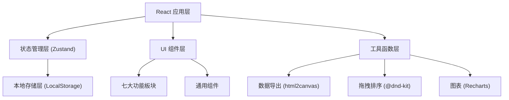
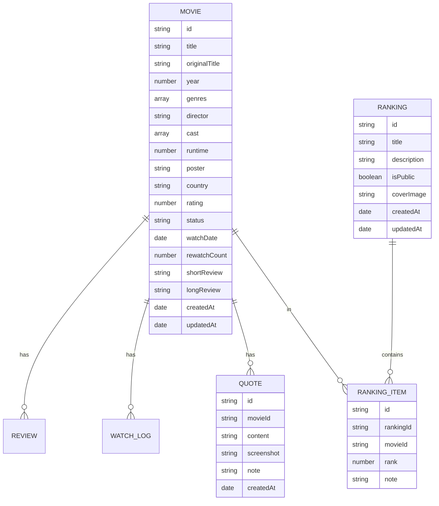

## 1. 架构设计



## 2. 技术描述

- **前端框架**：React@18 + TypeScript + Vite
- **样式方案**：TailwindCSS@3 + CSS 变量（主题系统）
- **状态管理**：Zustand（轻量级，适合本地数据管理）
- **图表库**：Recharts（React 图表库，支持热力图、柱状图等）
- **拖拽排序**：@dnd-kit（现代拖拽库，性能优秀）
- **图片导出**：html2canvas（DOM 转图片）
- **图标**：Lucide React（线性图标库）
- **数据存储**：LocalStorage（纯前端本地存储）
- **初始化工具**：Vite 官方脚手架

## 3. 目录结构

```
src/
├── components/          # 通用组件
│   ├── Layout/         # 布局组件
│   ├── MovieCard/      # 影片卡片
│   ├── Modal/          # 模态框
│   └── ...
├── pages/              # 七大板块页面
│   ├── Library/        # 片库导入
│   ├── Calendar/       # 观影日历
│   ├── Rating/         # 评分矩阵
│   ├── Rankings/       # 榜单编辑
│   ├── Quotes/         # 台词摘录
│   ├── Cards/          # 图文卡片
│   └── Dashboard/      # 数据总览
├── store/              # 状态管理
│   └── useStore.ts
├── types/              # TypeScript 类型定义
│   └── index.ts
├── utils/              # 工具函数
│   ├── storage.ts      # 本地存储
│   ├── export.ts       # 导出功能
│   └── mock.ts         # Mock 数据
├── styles/             # 全局样式
│   └── globals.css
├── App.tsx
└── main.tsx
```

## 4. 路由定义

| 路由 | 用途 |
|------|------|
| /library | 片库导入 - 影片管理、添加、筛选 |
| /calendar | 观影日历 - 日历视图、热力图 |
| /rating | 评分矩阵 - 评分图表、分布统计 |
| /rankings | 榜单编辑 - 榜单管理、拖拽排序 |
| /quotes | 台词摘录 - 台词墙、台词管理 |
| /cards | 图文卡片 - 卡片生成、导出图片 |
| /dashboard | 数据总览 - 统计分析、偏好分析 |
| /settings | 设置 - 数据备份、恢复 |

## 5. 数据模型

### 5.1 数据模型定义



### 5.2 数据类型定义

```typescript
// 影片状态
type WatchStatus = 'wish' | 'watching' | 'watched' | 'dropped';

// 影片
interface Movie {
  id: string;
  title: string;
  originalTitle?: string;
  year: number;
  genres: string[];
  director: string;
  cast: string[];
  runtime?: number;
  poster?: string;
  country?: string;
  rating: number; // 0-10
  status: WatchStatus;
  watchDate?: string; // ISO date
  rewatchCount: number;
  shortReview?: string;
  longReview?: string;
  createdAt: string;
  updatedAt: string;
}

// 榜单
interface Ranking {
  id: string;
  title: string;
  description?: string;
  isPublic: boolean;
  coverImage?: string;
  movieIds: string[]; // 按顺序排列的影片ID
  createdAt: string;
  updatedAt: string;
}

// 台词
interface Quote {
  id: string;
  movieId: string;
  content: string;
  screenshot?: string; // base64
  note?: string;
  createdAt: string;
}

// 观影记录
interface WatchLog {
  date: string;
  movieIds: string[];
  count: number;
}

// 应用状态
interface AppState {
  movies: Movie[];
  rankings: Ranking[];
  quotes: Quote[];
  settings: {
    theme: 'dark' | 'light';
    defaultYear: number;
    privacy: 'public' | 'private';
  };
}
```

### 5.3 本地存储结构

- Key: `film-tracker-data`
- 存储格式：JSON 字符串
- 包含：movies, rankings, quotes, settings

## 6. 核心技术方案

### 6.1 数据持久化
- 使用 Zustand + persist 中间件
- 自动同步到 LocalStorage
- 支持导入/导出 JSON 备份文件

### 6.2 图片导出
- 使用 html2canvas 将 DOM 元素转换为 Canvas
- 支持导出 PNG/JPG 格式
- 支持九宫格切分导出

### 6.3 拖拽排序
- 使用 @dnd-kit/core 和 @dnd-kit/sortable
- 支持榜单内影片排序
- 支持跨榜单拖拽

### 6.4 图表可视化
- 使用 Recharts 实现评分分布柱状图
- 使用 CSS Grid 实现热力图
- 类型评分雷达图使用 Recharts RadarChart

### 6.5 响应式布局
- 桌面端：侧边导航 + 主内容区
- 平板端：收起侧边栏为图标模式
- 移动端：底部 Tab 导航 + 单列内容
